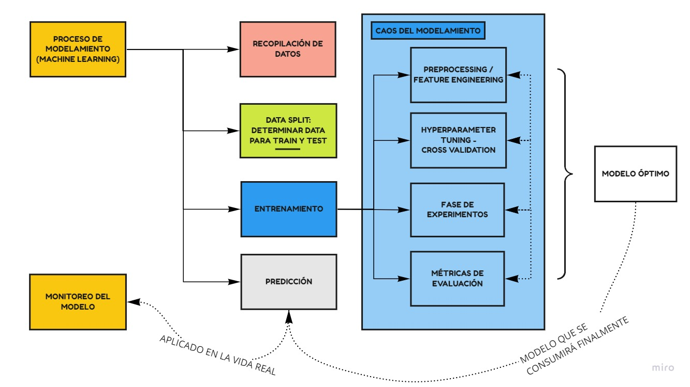
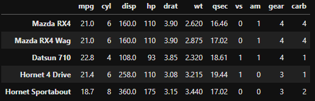
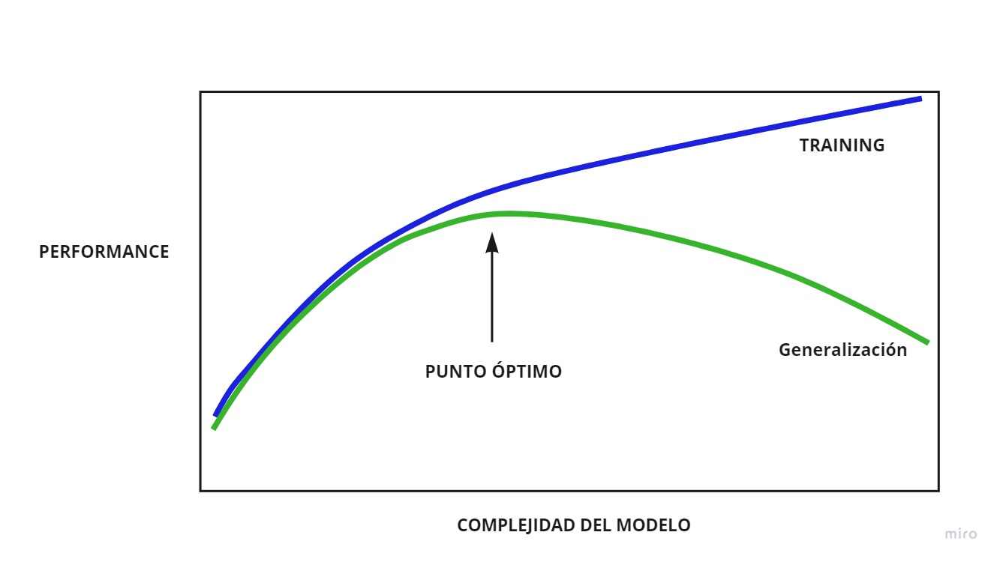

```{r setup, include=FALSE}
library(reticulate)
use_condaenv(condaenv = 'MLprojects')
options(htmltools.dir.version = FALSE)
knitr::opts_chunk$set(cache=TRUE)
```

```{r xaringan-themer, include=FALSE}
library(xaringanthemer)
solarized_light(
  code_font_family = "Fira Code",
  code_font_url    = "https://cdn.rawgit.com/tonsky/FiraCode/1.204/distr/fira_code.css"
)


```

# Qué es modelar?

Modelar es describir una realidad utilizando Lenguajes/Conceptos Matemáticos.
Un modelo se utiliza para explicar un sistema, estudiar los efectos de sus componentes y hacer predicciones.

> "...en esencia , todos los modelos están equivocados, pero algunos son útiles..."

*George Edward Pelham Box*


### Qué es Machine Learning?
Machine Learning es la capacidad de enseñar a un computador. Una definición formal podría ser:

> Una maquina se dice que aprende de la **Experiencia E**, respecto a una clase de **Tarea T** medido por una medida de **Performance P** si su performance de la **Tarea T** medido a través de **P** mejora con la **Experiencia E**. 

*Tom Mitchell, 1997*

---


# Tipos de Modelamiento

.pull-left[

### Supervised Learning
  - Modelos de Regresión 
  - Modelos de Clasificación
    - Modelos Binarios
    - Modelos Multiclase
    - Modelos Multilabel

### Unsupervised Learning
  - Clustering
  - Reducción de Dimensionalidad
  - Factorization Machines
  ]
  
.pull-right[

### Semi Supervised Learning


### Reinforcement Learning
 - Autos autónomos
 - Robots autónomos
 - X Autónomo

]

---
class: center

# Flujo de un Problema de Machine Learning

```{r, echo = F, out.height= 500}

```

---

.left-column[

# Scikit Learn

```{r, echo = F, out.width= 300}
knitr::include_graphics("img/scikit_logo.png")
```


]

.right-column[

* Es una librería de código abierto en Python diseñada para Machine Learning. 
* Nace como un proyecto de Google Summer of Code project, tiene más de 10 años de desarrollo y está auspiciada por:
  - Microsoft
  - Intel
  - Nvidia
  - Universidad de Columbia
  - Inria
  - BNP Paribas
  - entre otros.
* Su documentación es demasiado buena. Incluyendo claras instrucciones de cómo usar su API, además de códigos de ejemplo y la teoría asociada a cada modelo. Además todos los modelos suelen tener papers asociados citados en la documentación.
* Es sumamente estricta al momento de aceptar nuevos modelos. Suele exigir 3 años desde su publicación en papers más 200+ citas y uso masivo.

> [`Scikit-learn`](https://scikit-learn.org/stable/index.html) está orientado a modelos predictivos del lado del ML, mientras que [`statsmodels`](https://www.statsmodels.org/dev/index.html) está orientado a la inferencia y  y modelos más del lado estadístico.


]
---

# Scikit Learn API

```{python, eval = F}
X # estructura de datos de dos dimensiones, matriz de features
y # estructura de datos de una dimensión*, vector de target
```

.pull-left[

#### **Estimators**
```{python, eval = F}

from sklearn.submodule import Estimator

estimator = Estimator(p_1, p_2,..., p_k)
estimator.fit(X,y)
estimator.predict(X)*
estimator.score(X,y)

```
]
.pull-right[

#### **Transformers**

```{python, eval = F}
from sklearn.submodule import Transformer

transformer = Transformer(p_1,p_2,...,p_k)
transformer.fit(X,y)
transformer.transform(X)
transformer.fit_transform(X,y)

```
]

.footnote[

<br>
\* Para modelos de clasificación Multiclass o Multilabel este vector podría ser bidimensional también.

\* Algunos modelos poseen también un método .fit_predict(X)  
\* La API de `scikit-learn` es sumamente ordenada y **consistente** por lo que es fácil de entender/aprender.  
\* Normalmente para Estimators Supervisados existirá la versión `Classifier` y `Regressor`.

]


---

# Qué es un modelo?

Normalmente estamos acostumbrados a calcular funciones, donde dado un valor de X obtenemos un valor de y siempre y cuando conozcamos la función.

* $y = f(x)$
* $f(x) = x$
* $f(x) = x^2$
* $f(x) = log(x)$
* $f(x) = \sqrt{x}$
* $f(x) = blackbox$

En un modelo, nosotros conocemos los valores de entrada X y conocemos los valores de salida y, lo que no sabemos es $f(\cdot)$. Por lo tanto al modelar, lo que queremos encontrar es el valor de $f(\cdot)$ tal que cuando le agreguemos X, obtengamos y.

> En `scikit-learn` un modelo será la combinación de Estimators y Transformers con hiperparámetros óptimos que realicen una tarea T determinada.

---

# Ejemplos

.pull-left[
Determinar el precio de una casa dado que conozco: 
* N de baños,
* N de dormitorios
* Precio de Arriendo,
* Ubicación
* Barrio
* etc.

> **Problema de Regresión**

]

.pull-right[
Determinar si una vacuna contra una enfermedad será efectiva o no si conocemos:
* Concentración de Antígenos,
* Resultados anteriores,
* Dosis
* etc

> **Problema de Clasificación**

]

---

# Problemas de Regresión

Los problemas de Regresión son aquellos donde nuestra variable a predecir $y$ es de tipo continua. 

.pull-left[
```{r, echo = F, out.width= 500}
knitr::include_graphics("img/regresion.png")
```


]

.pull-right[
```{r, echo = F, eval = TRUE, out.width= 800}
knitr::include_graphics("img/modelo.png")
```

]

> NOTA: En este caso la experiencia **E** corresponde a los datos, la tarea **T** corresponde a un problema de Regresión y la métrica **P** podría corresponder al error promedio.


---

# La Regresión Lineal

.pull-left[

```{r, echo = F, eval = TRUE, out.width= 700}
knitr::include_graphics("img/regresion.png")
```

]

.pull-right[

$$f(X) = \sum_{i = 0}^p \beta_i X_i + \epsilon_i,\, p: \text{ Número de Features}$$

Los valores de $\beta$ se obtienen mediante un proceso de optimización, este método puede ser:

* Mínimos Cuadrados
* Stocastic Gradient Descent.
* etc.

En ambos métodos se busca minimizar una función de costo, de tal manera de encontrar $\beta_i$ óptimos que minimizen el error.

$$J = \sum_{i}^n(y_i - \hat{y_i})^2, \, n: \text{Número de Observaciones}$$
]

> NOTA: Una función de Costo refleja el error asociado al modelo en cuestión. (ERROR DE AJUSTE)

---

# Aplicación en Scikit-Learn

.pull-left[
```{python, eval = F}

import pandas as pd
df = pd.read_csv('mtcars.csv',index_col = 0)
X = df.drop(columns = 'mpg')
y = df.mpg

```

]

.pull-right[

```{r, echo = F, eval = TRUE, out.width= 700}

```

]

```{python, eval = FALSE}

from sklearn.linear_model import LinearRegression
lr = LinearRegression()
lr.fit(X,y)
lr.score(X,y)

```
--

> `0.8690157644777647`

[Ver Docs](https://scikit-learn.org/stable/modules/generated/sklearn.linear_model.LinearRegression.html)

.footnote[
* `.score()` devuelve el $R^2$ Score para modelos de regresión. Esta métrica va entre 0 y 1, siendo 0 el peor ajuste y 1 un ajuste perfecto.
]

---

# Aplicación en Scikit-Learn

* Es posible extraer cada uno de los coeficientes obtenidos al optimizar por mínimos cuadrados. $\beta_i$

```{python, eval = FALSE}

lr.coef_
```

--

> `array([-0.11144048,  0.01333524, -0.02148212,  0.78711097, -3.71530393,
        0.82104075,  0.31776281,  2.52022689,  0.65541302, -0.19941925])`
        
--
        
* Además se puede calcular el Intercepto: $\beta_0$

```{python, eval = FALSE}

lr.intercept
```
--

> `12.30337415599627`


--

## ¿Cuál es la interpretación de cada $\beta_i$?

---

# Bias-Variance Trade-Off

.pull-left[

```{r, echo = F, eval = TRUE, out.width= 700}
knitr::include_graphics("img/bias-variance.jpeg")
```

]

.pull-right[

* **Bias/Sesgo**: Corresponde a la simplificación de los supuestos que el modelo hace para que el modelo se ajuste al Target de mejor manera.

* **Variance/Varianza**: Corresponde a las variaciones de la estimación dependiendo de cómo se entrene.

```{r, echo = F, eval = TRUE, out.height= 300}
knitr::include_graphics("img/regresion.png")
```

]

---

# Bias-Variance Trade-Off

.pull-left[

#### Underfitting/Subajuste
```{r, echo = F, eval = TRUE, out.height= 200}
knitr::include_graphics("img/regresion.png")
```

]

.pull-right[

#### Overfitting/Sobreasjustado
```{r, echo = F, eval = TRUE, out.height= 200}
knitr::include_graphics("img/regresion.png")
```

]

--
.center[


```{r, echo = F, eval = TRUE, out.height= 200}
knitr::include_graphics("img/regresion.png")
```

]


---

# Honest Assessment

Cuando se quiere que alguien aprenda, normalmente se enseña contenido/materia (**E**) para realizar una tarea (**T**) y luego se mide (**P**). Pero nunca se mide lo aprendido con respuestas que ya viste.

En los modelos, se debe aplicar exactamente lo mismo. El modelo debiera ser entrenado con $E_{train}$ y luego medido con $E_{test}$ que no haya visto previamente demodo de medir de manera honesta si **'aprendió'** o **'memorizó'**.

.center[
```{r, echo = F, eval = TRUE, out.height= 350}
knitr::include_graphics("img/train_test.png")
```
]

---
# Implementación en Scikit-Learn


```{python, eval = FALSE}
from sklearn.model_selection import train_test_split

# pueden escribir este código en una sóla línea
X_train, X_test, y_train, y_test = train_test_split(df.drop(columns = 'mpg'), df.mpg, 
  test_size = 0.3, random_state = 123)
```
* Esto genera 2 subsets de Train y Test, uno para entrenar y el otro para medir performance. Luego para modelar, el código cambia levemente.

```{python, eval = FALSE}
from sklearn.linear_model import LinearRegression
lr = LinearRegression() # crea el modelo
lr.fit(X_train,y_train) # entrenamiento en el train_set
lr.score(X_test,y_test) # evaluación en el test_set
```

--

> `0.5347705850352262`

> **NOTA**: Es posible apreciar que la métrica de performance disminuyó drásticamente, ya que en este caso se está realizando una evaluación honesta de la performance en un dataset que nunca ha visto.

---

# Ejercicios

Ajuste una Regresión Lineal y mida su performance en los siguientes datasets:

> NOTA: Utilice siempre un `random_state = 123`

.pull-left[

#### Diabetes Dataset

```{python, eval = FALSE}
from sklearn.datasets import load_diabetes
diabetes = load_diabetes(as_frame = True)
X = diabetes.data
y = diabetes.target
```
* Qué se está prediciendo?
* Genere un split del 30% test.
* Calcule cuál es la variable que más aporta al target y la que más resta.
{{content}}

]

.pull-right[

#### Boston Dataset

```{python, eval = FALSE}
from sklearn.datasets import load_boston
X,y  = load_boston(return_X_y  = True)
names = load_boston()['feature_names']
```
* Qué se está prediciendo?
* Genere un split del 20% test.
* Calcule cuál es la variable que más aporta al target y la que más resta.

]


---

# Ejercicios

.pull-left[

> `Score Train: 0.5174979976746197`
> `Score Test: 0.5078285584893742`
> `Max coef: s5`  
> `Min coef: s1`

]


.pull-right[

> `Score Train: 0.7559380876016175`  
> `Score Test: 0.6592466510354097`
> `Max coef: RM`  
> `Min coef: NOX`

]

--

```{python, eval = FALSE}
# Solución Diabetes

X_train, X_test, y_train, y_test = train_test_split(X,y, test_size = 0.3, random_state = 123)

lr = LinearRegression()
lr.fit(X_train, y_train)
print('Score Train:', lr.score(X_train, y_train))
print('Score Test:', lr.score(X_test, y_test))
ind_pos = np.argmax(lr.coef_)
ind_neg = np.argmin(lr.coef_)
print('Max coef:', X.columns[ind_pos])
print('Min coef:', X.columns[ind_neg])
```

---

# Bias-Variance Tradeoff

.center[
```{r, echo = F, eval = TRUE, out.width=900}

```
]

---

# Métricas de Performance (Regresión)

* **Scorers**: Los scorers indican ajuste del modelo, normalmente más alto es mejor
* **Errors/Losses**: Indican la diferencia entre el valor predicho y el valor real, en este caso, un valor más bajo es mejor.

### MSE: Mean squared error

.pull-left[

$$MSE = \frac{1}{N} \sum_{i= 1}^{N}(y_i-\hat{y_i})^2$$


**Pros**:
* Métrica fácil de optimizar.
* Simple de entender.
* Castiga los errores grandes de manera más severa mientras que errores pequeños de manera más suave.
]

.pull-right[

```{python, eval = FALSE}
from sklearn.metrics import mean_squared_error

mean_squared_error(y_test, y_pred)
```
**Contras**:
* Métrica en unidades cuadráticas, dificil de interpretar.
* Es sensible a los valores extremos.

]


---

# Métricas de Performance (Regresión)

### RMSE: Root Mean squared error

Corresponde a una variación del MSE manteniendo casi todas sus características.

$$RMSE = \sqrt{MSE} =  \sqrt{\frac{1}{N} \sum_{i= 1}^{N}(y_i-\hat{y_i})^2}$$
* Actualmente no existe una implementación directa en Python por lo que se calcula de la siguiente manera:

```{python, eval = FALSE}
from sklearn.metrics import mean_squared_error

np.sqrt(mean_squared_error(y_test, y_pred))
```

* **Pro**: Se mide en las mismas unidades que la variable a predecir. Por lo tanto es interpretable como un error promedio.

---

# Métricas de Performance (Regresión)

### MAE: Mean Absolute Error

$$MAE = \frac{1}{N}\sum_{i =1}^{N}|y_i-\hat{y_i}|$$
```{python, eval = FALSE}
from sklearn.metrics import mean_absolute_error

mean_abolute_error(y_test, y_pred)
```

En este caso se utiliza el valor absoluto y todos los valores son penalizados de manera proporcional.

**Pro**
* Es una métrica muy robusta en contra de los valores extremos.


---

# Métricas de Performance (Regresión)

### $R^2$ Score: 

Corresponde al porcentaje de Ajuste de un modelo. Varía entre 0 y 1.

$$R^2 = 1 - \frac{\frac{1}{N}\sum_{i=1}^N(y_i - \hat{y_i})^2}{\frac{1}{N}\sum_{i=1}^N(y_i - \overline{y})^2}= 1- \frac{MSE}{\frac{1}{N}\sum_{i=1}^N(y_i - \overline{y})^2}$$

```{python, eval = FALSE}
from sklearn.metrics import r2_score

r2_score(y_test, y_pred)
```

**Pros**:
* Es una métrica que permite medir por sí sola.

**Contras**: Se ve afectada por lo complejidad del modelo, por lo que en ML no es tan usada ya que todos los modelos son relativamente complejos.


.footnote[* En `scikit-learn` el $R^2$ puede ser un valor negativo para demostrar un pésimo ajuste.]
---

# Métricas de Performance (Regresión)

#### MSPE: Mean Squared Percentage Error* 
Corresponde al MSE pero de tipo porcentual


#### MAPE: Mean Absolute Percentage Error* 

Corresponde al MAE de tipo Porcentual

#### Median Absolute Error

Error similar al MAE pero utilizando la mediana para agregar los valores.

#### Mean Squared Log Error

MSE pero en escala logarítmica.


[Ver docs](https://scikit-learn.org/stable/modules/model_evaluation.html)


.footnote[*Estas métricas no se encuentran implementadas actualmente en `scikit-learn` de manera directa, pero pueden ser métricas útiles al momento de evaluar un modelo.]


---

# Ejercicios

> NOTA: Utilice siempre un `random_state = 123`

Utilice los datasets anteriores de Diabetes y Boston para relizar lo siguiente:

* Mostrar la Predicción de los primeros 10 casos del test set en conjunto con los valores reales.
  - Utililce el método `.predict()` para calcular `y_pred` en el test set.
* Calcular las métricas de $R^2$, MSE, RMSE y MAE para el train_set como para el test_set.
* Qué se puede concluir a partir de aquello?

* Muestre qué coeficientes son más importantes en magnitud y su contribución al modelo.
* Cuánto vale el Intercepto para cada modelo?


---

# Ejercicios

> `Diabetes:`  
> `R2 Train: 0.5174979976746197`  
> `R2 Test 0.5078285584893742`  
> `MSE Train: 2854.168253060431`  
> `MSE Test: 2926.8005772468828`  
> `RMSE Train: 53.424416263169704`  
> `RMSE Test: 54.099912913487046`  
> `MAE Train: 43.03474379534746`  
> `MAE Test: 44.48057319064366` 

--

> `Boston:`  
> `R2 Train: 0.7647156501433012`  
> `R2 Test 0.6485645742370703`  
> `MSE Train: 20.184336639873155`  
> `MSE Test: 28.40585481050824`  
> `RMSE Train: 4.492698146979514`  
> `RMSE Test: 5.329714327288869`  
> `MAE Train: 3.1219958710301117`  
> `MAE Test: 3.6913626771162673`  


