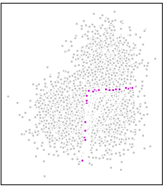
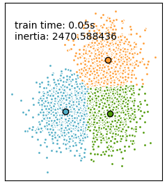
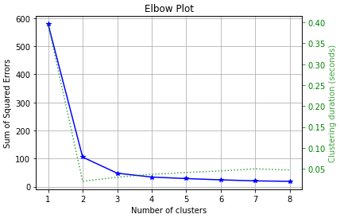
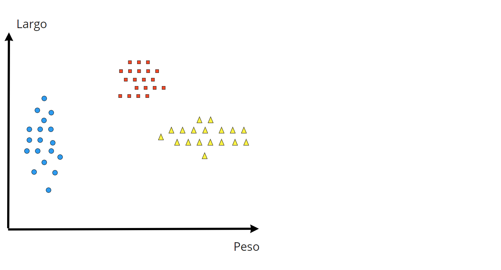
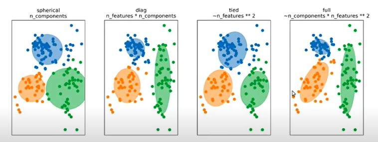

```{r setup, include=FALSE}
library(reticulate)
use_condaenv(condaenv = 'MLprojects')
options(htmltools.dir.version = FALSE)
knitr::opts_chunk$set(cache=TRUE)
```

```{r xaringan-themer, include=FALSE}
library(xaringanthemer)
solarized_light(
  code_font_family = "Fira Code",
  code_font_url    = "https://cdn.rawgit.com/tonsky/FiraCode/1.204/distr/fira_code.css"
)
```

# Aprendizaje no Supervisado

A diferencia de los modelos vistos hasta ahora. El aprendizaje no supervisado no contiene un vector objetivo/variable de respuesta $y$, es decir no hay un conocimiento a priori de los datos. Por lo tanto estos modelos no tienen una guía a la cual converger. 

Un ejemplo de aprendizaje no supervisado que ya hemos revisado es PCA, que es un procedimiento de Reducción de Dimensionalidad no supervisado que buscar maximizar la varianza explicada a través de las componentes principales.

Otros ejemplos:
* KMeans
* Gaussian Mixtures
* LDA (Latent Dirichlet Allocation)


---
# K-Means

Es un algoritmo muy sencillo que que encuentra K grupos de Datos minimizando la inercia entre un centroide dado y el resto de valores dentro del grupo.
La inercia se define como:

$$\sum_{\mu_j \in C}^n ||x_i-\mu_j||^2$$

Estos modelos entonces buscaran segmentar y generar clusters de datos que contengan cierta similaridad entre ellos, esta similaridad será medida por qué tan cercanos están.

.pull-left[

.right[
```{r, echo = F, eval = TRUE, out.width='50%'}

```
]
]
.pull-right[
.left[

```{r, echo = F, eval = TRUE, out.width='50%'}

```
]
]

---

# Implementaición en Scikit-learn

```{python, eval = FALSE}
from sklearn.cluster import KMeans
km = KMeans(n_clusters = 8)
km.fit(X)
Km.predict(X)
km.pit_predict(X)
```
### Hiperparámetros
**n_clusters**: Número de Grupos a generar.

`.inertia`: Suma total de las distancias al cuadrado de cada punto con su centroide más cercano.

---

# Elbow Plot
Permite encontrar el número óptimo de clusters.

```{python, eval = FALSE}
import scikitplot as skplt
km = KMeans(random_state=123)
skplt.cluster.plot_elbow_curve(km, X, cluster_ranges=range(1, 9))
plt.show()
```
.center[

```{r, echo = F, eval = TRUE, out.width='50%'}

```
]

---

# Gaussian Mixtures

.left-column[

```{r, echo = F, eval = TRUE, out.width='80%'}

```

* Ajusta una Distribución Normal multivariable a cada grupo y luego las combina para entregar una probabilidad de pertencer a cada grupo.

]

.right-column[

```{r, echo = F, eval = TRUE, out.width='90%'}
knitr::include_graphics("img/gmm.PNG")
```
]
---

# Implementación en Scikit-learn

```{python, eval = FALSE}
from sklearn.mixture import GaussianMixture
gmm = GaussianMixture(n_components = 1, random_state = 123)
y_labels = gmm.fit_predict(X)
y_proba = gmm.predict_proba(X)
```

**n_components**: Número de Grupos a generar.           **covariance_type**: Tipo de Matriz Covarianza.  
`.bic(X)` permite calcular el bic para el Input X. Comparando BIC podría ser posible calcular qué modelo es óptimo.

.center[
```{r, echo = F, eval = TRUE, out.width='70%'}

```
]


---
class: inverse, center, middle

<a rel="license" href="http://creativecommons.org/licenses/by-nc-sa/4.0/"></a><br /><span xmlns:dct="http://purl.org/dc/terms/" data-property="dct:title">Todas las clases del curso de Machine Learning Aplicado en Scikit-Learn</span> fueron creadas por
<span xmlns:cc="http://creativecommons.org/ns#" data-property="cc:attributionName">Alfonso
Tobar</span> y están licenciadas bajo <a rel="license" href="http://creativecommons.org/licenses/by-nc-sa/4.0/">Creative
Commons Attribution-NonCommercial-ShareAlike 4.0 International
License</a>.


