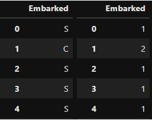

```{r setup, include=FALSE}
library(reticulate)
use_condaenv(condaenv = 'MLprojects')
options(htmltools.dir.version = FALSE)
knitr::opts_chunk$set(cache=TRUE)
```

```{r xaringan-themer, include=FALSE}
library(xaringanthemer)
solarized_light(
  code_font_family = "Fira Code",
  code_font_url    = "https://cdn.rawgit.com/tonsky/FiraCode/1.204/distr/fira_code.css"
)


```

# Un nuevo modelo: KNN

KNN es el abreviado de K nearest neighbors y es uno de los modelos más sencillos, que está basado en distancias. En los problemas de Regresión mide la distancia a los $k$ vecinos  más cercanos y su predicción se hace promediando sus valores.

.left-column[

```{r, echo = F, out.width='300%'}
knitr::include_graphics("img/regresion.png")
```

]

.right-column[

```{python, eval = FALSE}
from sklearn.neighbors import KneighborsRegressor
# n_neighbors es un hiperparámetro.
# es el valor por defecto
knn = KNeighborsRegressor(n_neighbors = 5)
knn.fit(X,y)
knn.score(X,y)
```

]

---

# Aplicando a datos

#### Crear un modelo que prediga la edad de un pasajero utilizando Pclass, SibSp y Fare*1000.

> Nota: A modo de ejercicio aplicaremos el efecto de la Inflación (exagerada) dentro del Modelo.

#### Calcular métricas de Train y de Test.

---

# Cómo mejorar el modelo?

Muchas veces mejorar el modelo es complejo con la data que se tiene, por lo tanto es necesario, transformar los datos para poder utilizar data de mejor manera.

Este proceso de transformación de datos se conoce como preprocesamiento y **NO HAY UNA FORMULA CORRECTA DE LLEVARLO A CABO**<sup>1</sup>.

Para realizar estos procesos de manera ordenada `scikit-learn` posee los transformers.

```{python, eval = FALSE}
from sklearn.submodule import Transformer
tr = Transformer()
tr.fit(X)
tr.transform(X)

```


.footnote[[1]: Aunque hay formas que no son correctas de hacerlo para evitar **data leakage**]

---

# StandardScaler()

Corresponde a la aplicación del Z-score en las variables de entrenamiento (`features`).

Este proceso puede dividirse en dos:

* Centrar: Restar la media
* Escalar: Dividir por la desviación estándar

> NOTA: Ambas operaciones se aplican por defecto pero se pueden desactivar a través de parámetros. [Ver docs](https://scikit-learn.org/stable/modules/generated/sklearn.preprocessing.StandardScaler.html)

```{python, eval = FALSE}
from sklearn.preprocessing import StandardScaler
sc = StandardScaler()
sc.fit(X)
sc.transform(X)
sc.fit_transform(X)
```

> NOTA: El resultado de esta operación es un Numpy Array.

Escalar la data está recomendado cuando hay variables que contienen distintas escalas. En general modelos lineales como LR, KNN, SVM y NN se verán beneficiados.

#### Escalar `mtcars`

---

# Data Leakage

Data leakage se traduce como fuga de información y se refiere a una contaminación del proceso de modelamiento en la cual información de su Test set de alguna manera llega al proceso de entrenamiento.

Esto es perjudicial ya que el modelo se entera de cómo es el Test durante su entrenamiento, por lo que genera inestabilidad al momento de generalizar.


La manera más fácil de fugar información es a través del `StandardScaler()`.

.center[

```{r, echo = F, out.height= 300}
knitr::include_graphics("img/train_test.png")
```

]


---

# Con Fuga

```{python, eval = FALSE}
sc = StandardScaler()
X_sc = sc.fit_transform(X)

X_train,X_test,y_train,y_test = train_test_split(X_sc, y, test_size = 0.3, random_state = 123)


knn = KNeighborsRegressor()
knn.fit(X_train, y_train)
y_pred = knn.predict(X_test)

evaluation(y_test, y_pred)
```

> `RMSE: 12.848766382620424`  
> `MAE: 3.2011839337500954`  
> `R2: 0.11099837200965901`  


---

# Sin Fuga

```{python, eval = FALSE}
X_train,X_test,y_train,y_test = train_test_split(X, y, test_size = 0.3, random_state = 123)

sc = StandardScaler()
X_train_sc = sc.fit_transform(X_train)
X_test_sc = sc.transform(X_test)

knn = KNeighborsRegressor()
knn.fit(X_train_sc, y_train)
y_pred = knn.predict(X_test_sc)

evaluation(y_test, y_pred)
```

> `RMSE: 12.834229356766496`  
> `MAE: 3.201102442614478`  
> `R2: 0.11300885745398226`  


> NOTA: **Nunca aplicar preprocesamiento antes del Data Split.**

---

# Cómo agregar variables categóricas?

Las variables categóricas no son variables que los modelos procesan en primera instancia y normalmente deben pasar primero por un proceso de **encoding**<sup>2</sup> .

#### `Scikit-Learn` posee algunas funciones de enconding que se pueden encontrar en `sklearn.preprocessing`, pero existe una librería alternativa llamada category-encoders<sup>3</sup> que será la que utilizaremos.

* La principal ventaja de category-encoders es que devuelve pandas DataFrames lo cuales son más sencillos de trabajar, además de proveer soporte para encodings más avanzados no disponibles en `scikit-learn`.
* También detecta automáticamente clases category y object las cuales son transformadas directamente.
* Es posible escoger qué variables encodear además de lidiar automáticamente con variables no vistas durante el entrenamiento y missing values. [Ver docs](https://contrib.scikit-learn.org/category_encoders/)

```{python, eval = FALSE}
from category_encoders import OrdinalEncoder, OneHotEncoder # Opción recomendada
from sklearn.preprocessing import OrdinalEncoding, OneHotEncoder # no tan recomendada
```

.footnote[
[2]: Encoding se refiere al proceso de llevarlas a un código numérico que represente cada categoría.  
[3]: category-encoders es parte de scikit-contrib, que son librerías complementarias recomendadas por el mismo `scikit-learn`.]

---

# OrdinalEncoder()

Corresponde al encoder más sencillo en el cual cada categoría se le asigna un número entero.


.pull-left[

```{python, eval = FALSE}
from category_encoders import OrdinalEncoder
X = df.Embarked

ord_enc = OrdinalEncoder()
df_new = ord_enc.fit_transform(X)

```

```{r, echo = F, out.height= 300}

```
]

.pull-right[

* Sencilla
* No agranda de tamaño el df de salida.
* Se recomienda para variables ordinales.
* Los modelos de árboles aprovechan de mejor manera este encoding.

<br>
<br>

```{python, eval = FALSE}
df_new.Embarked.value_counts()
```

> `1    644`  
> `2    168`  
> `3     77`  
> `4      2`  

Utilizando `.get_params()` es posible obtener de qué manera se hizo el mapeo de variables.

]


---

# OneHotEncoder()

Quizás corresponde al encoding más popular en el cual se transforma cada categoría en una columna binaria.

.pull-left[

```{python, eval = FALSE}
X = df.Embarked
# variables con nombres de categorías
ord_enc = OneHotEncoder(use_cat_names = True)
ord_enc.fit_transform(X)
```


```{r, echo = F, out.height= 250}
knitr::include_graphics("img/onehot.png")
```

]

.pull-right[

* Computacionalmene más complejo que OrdinalEncoder.
* El df de salida es más grande que el de entrada.
* No se recomienda para variables con un gran número de categorías.
* En general entrega mejores resultados que el OrdinalEncoder.

]


---

# Aplicando un Modelo

#### Generar un Modelo para predecir la Edad de los pasajeros del Titanic utilizando 'Pclass','SibSp','Fare' y 'Embarked'.

* Comparar el performance de KNN y de LinearRegression.
* Compare los resultados obtenidos utilizando OrdinalEncoder y OneHotEncoder.
* Mostrar resultados en train y test.

--

.pull-left[

> `KNN + OneHot, Test:`  
> `RMSE: 12.716024352894255`  
> `MAE: 3.1656873129387146`  
> `R2: 0.12927223594120496`  
]

.pull-right[

> `LR + OneHot, Test:`  
> `RMSE: 12.478825703086661`  
> `MAE: 3.103176867446452`  
> `R2: 0.16145354315592952`  

]


---

# Simplificar Código: Pipelines

Cómo se puede observar a medida que se utilizan más operaciones de preprocesamiento el código comienza a ponerse más complejo y propenso a error. Es por eso que `scikit-learn` introduce el concepto de `Pipeline`.

El `Pipeline` permite el uso de varios estimators y transformers en orden, de tal manera de hacer el código más entendible.


```{python, eval = FALSE}
from sklearn.pipeline import Pipeline

pipe = Pipeline(steps = [
    ('ohe', OneHotEncoder()),
    ('sc', StandardScaler()),
    ('knn', KNeighborsRegressor())
])

pipe.fit(X_train, y_train)
y_pred = pipe.predict(X_test)


```


