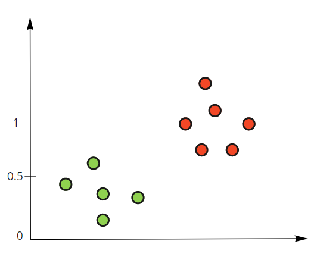
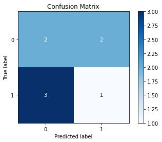
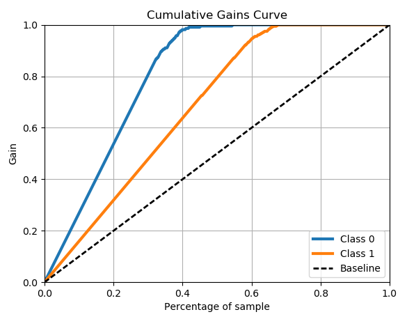

```{r setup, include=FALSE}
library(reticulate)
use_condaenv(condaenv = 'MLprojects')
options(htmltools.dir.version = FALSE)
knitr::opts_chunk$set(cache=TRUE)
```

```{r xaringan-themer, include=FALSE}
library(xaringanthemer)
solarized_light(
  code_font_family = "Fira Code",
  code_font_url    = "https://cdn.rawgit.com/tonsky/FiraCode/1.204/distr/fira_code.css"
)


```


# Problemas de Clasificación

Los procesos de Clasificación corresponden a una generalización de los problemas de regresión asociado a un Target Discreto/Categórico.

Coloquemos el siguiente ejemplo donde: 

$$y = \begin{cases} 1, 
& \text{si es tumor maligno} \\
0, & \text{si es tumor benigno}
\end{cases}$$

.center[

```{r, echo = FALSE, out.width = 600}
knitr::include_graphics("img/clasificacion.png")
```

]


---

# La Función Logística/Sigmoide

.left[
$$g(z) = \frac{1}{1 + e^{-z}}$$

]


.pull-left[


```{r, echo = FALSE, out.width = 500}
knitr::include_graphics("img/logistic.png")
```
]


.pull-right[


$$y = \begin{cases} 1, 
& \text{si g(z) > 0.5} \\
0, & \text{en otro caso}
\end{cases}$$

<br>
<br>

> Notar que para que g(z) sea mayor que 0.5, z debe ser mayor a 0.

]


---

# La Regresión Logística

Luego cuando la Recta de decisión es mayor que cero, la regresión Logística predecirá valores mayores a 0.5, y para valores bajo la recta de decisión predecirá valores menores a 0.5.


.left-column[

```{r, echo = FALSE, out.width = 600}


```

]

.right-column[

> NOTA: Dado que el recorrido de la función Sigmoide es entre 0 y 1, este valor puede ser interpretado como la probabilidad de pertenecer a una clase. 

$$P[y] = g( \sum_{i = 0}^p \beta_i X_i + \epsilon_i)$$
$$y = \begin{cases} 1, 
& \text{si P[y] > 0.5} \\
0, & \text{en otro caso}
\end{cases}$$

```{python, eval = FALSE}
from sklearn.linear_model import LogisticRegression
lr = LogisticRegression(random_state = 123)
lr.fit(X,y)
lr.predict(X)
lr.predict_proba(X)
lr.score(X,y)
```

]


---

# KNN para Clasificación

Adicionalmente también podríamos implementar un modelo KNN para clasificación:

.left-column[

```{r, echo = FALSE, out.width = 600}


```


]

.right-column[
<br>
<br>

```{python, eval = FALSE}
from sklearn.neighbors import KNeighborsClassifier
knn = KNeighborsClassifier()
knn.fit(X,y)
knn.predict(X)
knn.predict_proba(X)
knn.score(X,y)
```


]


---

# Ejemplo

#### Implemente un modelo de Regresión Logistica y de KNN utilizando para predecir los sobrevivientes del Titanic, calculando su métrica de performance por defecto utilizando `.score()`.

* Para ello utilice como variables predictoras `Pclass`, `Sex`, `Age`, `Parch`, `Fare` y `Embarked`.
* Utilice un Encoder apropiado y escale las variables. 
* Repita el proceso utilizando la arquitectura de Pipelines.

---

# Métricas de Clasificación

Dentro de los problemas de clasificación existe una variedad gigante de métricas. Además dependiendo del área de estudio de estos problemas es que algunas se popularizan más que otras. Podríamos decir que existen las métricas que derivan de la matriz de Confusión y otras métricas,

### Matriz de Confusión

.pull-left[

```{r, echo = FALSE, out.width = 600}
knitr::include_graphics("img/conf_mat.jpeg")

```

]

.pull-right[

> NOTA: **XK**: **K** representa el valor predicho, **X** si es correcto o no respecto al valor real.

]

---

# Matriz de Confusión


.left-column[

## Ejemplo

.center[

```{r, echo = FALSE}
knitr::include_graphics("img/metrics.png")
```

]

]

.right-column[

```{python, eval = FALSE}
from scikitplot.metrics import plot_confusion_matrix
plot_confusion_matrix(valores.y_real, valores.y_pred)

```

.center[

```{r, echo = FALSE}

```


]


  
]

---

# Métricas Derivadas de la Matriz de Confusión

### Accuracy

$$Accuracy = \frac{TN+TP}{TN+TP+FN+FP} = \frac{2+1}{2+1+3+2} = 0.375$$ 

.left-column[

```{r, echo = FALSE}

```

]

.right-column[


**Pros**: 
* Métrica muy sencilla de entender. Se interpreta como los valores que han sido correctamente predichos.

**Contra**: 
* No muy útil para datasets desbalanceados ya que entrega falso optimismo.


]


---


# Métricas Derivadas de la Matriz de Confusión

### Precision-Recall

.pull-left[

$$Precision = \frac{TP}{TP+FP} = \frac{1}{1+2} = 0.33$$

```{r, echo = FALSE, out.width = 400}

```

]

.pull-right[

$$Recall = \frac{TP}{TP+FN} = \frac{1}{1+3} = 0.25$$

### Interpretación

* **Precision**: De todos los valores predichos en la clase k, cuántos de ellos fueron correctamente predichos?.

* **Recall**: De todos los valores que realmente correspondían a la clase k, cuántos fueron correctamente predichos?


]

???


**Precisión** es una buena medida cuando el costo de un falso positivo es alto. 
Spam: Si un mail lo predigo como spam el usuario podría perder información valiosa de un correo que necesita leer.
Walter White de Breaking Bad, le dijeron que moría y empezó a hacer metanfetaminas. Y qué costo.

**Recall** es una buena medida cuando quiero evaluar el costo de un falso negativo.

Detección de Fraude. Predecir que una transacción no es fraudulenta cuando en realidad lo es, puede resultar en un gran riesgo para el banco.
Cancer. Predecir que un tumor no es maligno cuando en realidad lo es puede dar una falsa sensación de seguridad al paciente cuando en realidad está en riesgo vital.


---
# Métricas Derivadas de la Matriz de Confusión

### F1

Precision y Recall son intercambiables y dependen del orden de las clases a predecir. Adicionalmente Precision y recall son antagonistas. Mejorar una empeora la otra y viceversa. Por lo tanto a veces se requiere buscar un equilibrio entre ambas y eso es lo que entrega F1. F1 corresponde a la media armónica de Precision y Recall.

$$F1 = 2 \ cdot \frac{Precision \cdot Recall}{Precision + Recall} = 2\cdot \frac{0.33 \cdot 0.25}{0.33 + 0.25} = 0.284$$


> NOTA: Es importante que dado que todas estas métricas dependen de la Matriz de Confusión pueden variar dependiendo del punto de corte escogido para seleccionar una predicción u otra (recordar que por defecto es 0.5).

```{python, eval = FALSE}
# permite mostrar un reporte con precision, recall, f1 y accuracy
from sklearn.metrics import classification_report
print(classification_report(y, y_pred, digits =2))
```

---

# Curva de Precision-Recall

Esta curva presenta el trade-off Precision-Recall de todos los puntos de corte. De esa manera se puede escoger el punto de corte que optimice la métrica que se quiere escoger o utilizar el área bajo la curva como una métrica de medida. 

```{python, eval = FALSE}

from scikitplot import plot_precision_recall
plot_precision_recall(y, y_proba)

```

.pull-left[

```{r, echo = FALSE, out.width= 400}
knitr::include_graphics("img/precision-recall.png")
```

]

.pull-right[

> NOTA: La utilización de esta curva es particularmente útil cuando se trabaja con clases desbalanceadas. Normalmente se utiliza el área bajo la curva (AUC) como una medida, donde 1 representa un modelo perfecto.

]

---
# Receiver Operating Characteristic/ROC

Esta curva representa el trade-off entre el recall (también llamado sensibilidad) y 1 - Especifidad, donde la Especifidad representa el Recall de la otra clase (para problemas binarios). Al igual que la curva representa este trade-off para todos los puntos de corte posible.

Adicionalmente existe una interpretación alternativa, en la cual la curva ROC representa la probabilidad de que un punto de la clase positiva tenga una mayor probabilidad que un punto de la clase negativa. Es decir, la probabilidad de que el modelo pueda ordenar las predicciones correctamente por probabilidad.


.pull-left[

```{r, echo = FALSE, out.width= 400}
knitr::include_graphics("img/roc.png")
```

]

.pull-right[

```{python, eval = FALSE}
from scikitplot import plot_roc
plot_roc(y, y_proba)

```

> NOTA: Al igual que la curva Precision-Recall esta métrica esta curva se mide utilizando una métrica de AUC.

]

---

# Curva de Ganancia

La curva de Ganancia corresponde a una curva que mide qué porcentaje de la data es necesario para encontrar un cierto porcentaje de la clase requerida.

```{python, eval = FALSE}
from scikitplot import plot_cumulative_gain
plot_cumulative_gain(y, y_proba)

```
.pull-left[

```{r, echo = FALSE, out.width= 450}

```

]

.pull-right[

> NOTA: Esta métrica suele ser una métrica muy importante en marketing en donde se puede garantizar un cierto porcentaje de acierto si es que se contacta una cierta muestra con mayor probabilidad de la población a predecir.

]


---

# Log-Loss

Logloss (también llamada Crossentropy en NN) corresponde a una métrica que penaliza el incorrecto cálculo de las probabilidades. Penaliza de manera logarítmica la lejanía entre la clase predicha y la predicción perfecta.

$$LogLoss = -(y \cdot log(p) + (1-y) \cdot log(1-p))$$
<br>
<br>

```{python, eval = FALSE}

from sklearn.metrics import log_loss
log_loss(y, y_pred)

```

> NOTA: Cuando lo más importante en el modelo es acertar lo mejor posible a la probabilidad entonces esta métrica puede ser de gran importancia ya que penaliza entre mayor incertidumbre probabilística exista.
Esta métrica es comparativa y entre menos sea, menor será el error.


