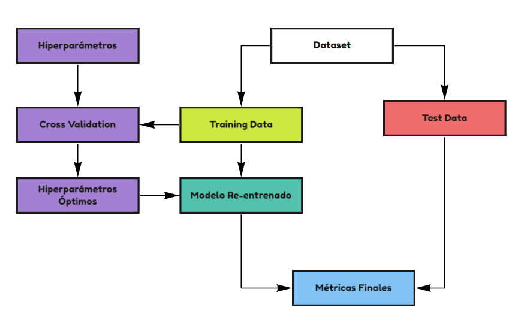
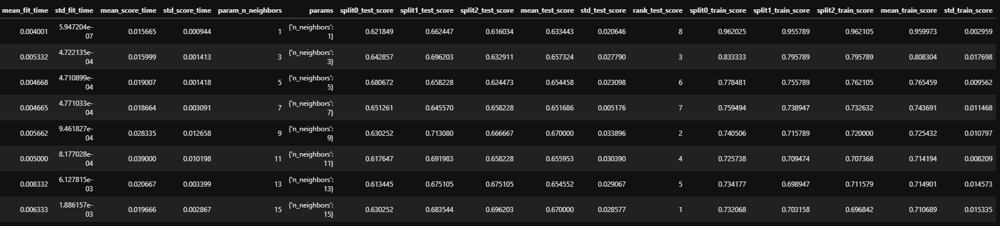

```{r setup, include=FALSE}
library(reticulate)
use_condaenv(condaenv = 'MLprojects')
options(htmltools.dir.version = FALSE)
knitr::opts_chunk$set(cache=TRUE)
```

```{r xaringan-themer, include=FALSE}
library(xaringanthemer)
solarized_light(
  code_font_family = "Fira Code",
  code_font_url    = "https://cdn.rawgit.com/tonsky/FiraCode/1.204/distr/fira_code.css"
)


```

# Cómo Mejorar un Modelo (de nuevo?)

.center[

```{r, echo = FALSE, out.width = 600}
knitr::include_graphics("img/model_complexity.png")
```

]


Cuando se prueba un algoritmo no se trata de utilizar un modelo y **si dio bien lo dejamos y si no lo botamos**. Normalmente muchos modelos pueden ser afinados, modificando su complejidad. Esta complejidad se varía mediante los **hiperparámetros de un modelo**. Entender los **hiperámetros** de un modelo es complejo y es necesario entender otros conceptos como la Regularización.


---
# Problema

El problema que esto suscita es: **¿cómo medimos el uso de distintos hiperparámetros (distintas complejidades) si para probar tenemos sólo el test set?** **Sería como hacer trampa**. Ya que sabemos que un modelo funciona mejor porque lo probamos en la data que me interesa, no porque de antemano sepamos que generaliza mejor (Sería como generar un overfit al test set).

## Generar otro Split

.center[

```{r, echo = FALSE, out.width = 600}
knitr::include_graphics("img/train_test_cv.png")
```

]

---

# Three Fold Split (Holdout)

.pull-left[

En el Three Fold Split el Dataset se divide en 3 partes:

* **Training Set**: Utilizado para entrenar el modelo con distintos Hiperparámetros.
* **Validation Set**: Utilizado para encontrar el mejor set de hiperparámetros.  
* **Test Set**: Utilizado para la evaluación final del modelo.

]

.pull-right[

.center[

```{r, echo = FALSE, out.width=200}
knitr::include_graphics("img/holdout.png")
```

]

]
```{python, eval = FALSE}

X_trainval, X_test, y_trainval, y_test = train_test_split(X,y, test_size = 0.2)
X_train, X_val, y_train, y_val = train_test_split(X_trainval, y_trainval, test_size = 0.2)

```

---

# K-Fold Cross Validation

.left-column[


**Pros**: 
* Mecanismo mucho más robusto para validar.
* Todas las muestras se usan en entrenamiento k-1 veces y una vez de validación.

**Contras**: 

* Más costoso computacionalmente
* Mayores tiempos de entrenamiento

> NOTA: Si bien el valor de K podría ser un parametro tuneable, K = 5 o 10 son los valores mayormente utilizados.

]

.right-column[

```{r, echo = FALSE, out.width = 600}
knitr::include_graphics("img/k-fold.png")
```

\* Imágen obtenida del sitio oficial de `Scikit-Learn`.

]

---

## Esquema de Validación 

.center[

\* Esquema adaptado del sitio oficial de `Scikit-Learn`
```{r, echo = FALSE, out.width = 700}

```

]

> NOTA: **Cross Validation** indica qué modelo usar mientras que el **evaluar en el Test Set** indica qué tan bueno es el modelo elegido.


---

# GridSearchCV / Implementación por Fuerza Bruta

Los procedimientos anteriormente mostrados se encuentran completamente automatizados en `Scikit-Learn` a través de `GridSearchCV`.

`GridSearchCV` es un meta-estimator, es decir, un Estimator que toma como argumento otro Estimator, por lo tanto hereda las propiedades del Estimator inicial tales como: `.fit()`, `.predict()`, etc.

```{python, eval = FALSE}
from sklearn.model_selection import GridSearchCV

params = {'n_neighbors': np.arange(1,17,2)}
knn = KNeighborsClassifier()
search = GridSearchCV(knn, params, cv = 5, return_train_score = True, n_jobs = -1)
search.fit(X_train, y_train)

# Resultados
print('Mejor Cross Val Score (Mean)', search.best_score_) # en Cross Validation
print('Mejor K:', search.best_params_)# Hiperparámetro óptimo

print('Mejor Score en el Test Set:', search.score(X_test, y_test)) # en el modelo reentrenado

```

> `Mejor Cross Val Score (Mean) 0.6769427755343249`  
> `Mejor K: {'n_neighbors': 7}`  
> `Mejor Score en el Test Set: 0.7039106145251397`  


---

# GridSearchCV / Implementación por Fuerza Bruta

```{python, eval = FALSE}
search.cv_results_
```
```{r, echo = FALSE}

```

.pull-left[
```{python, eval = FALSE}
search
```
.center[

```{r, echo = FALSE}
knitr::include_graphics("img/GCV.png")
```

]
]

.pull-right[
```{python, eval = FALSE}
search.best_estimator_
```
.center[

```{r, echo = FALSE}
knitr::include_graphics("img/knn.png")
```

]
]

---

## Otras metodologías de Cross Validation. 

Todas estas metodologías pueden utilizarse en conjunto con GridSearchCV e la siguiente forma:

```{python, eval = FALSE}
from sklearn.model_selection import LeaveOneOut, ShuffleSplit 
search = GridSearchCV(knn, param_grid = params, cv = LeaveOneOut(), n_jobs = -1)
```

* **Leave One Out**: # Deja una muestra cómo validación. Extremadamente lento, por lo que se recomienda sólo cuando hay muy poca data disponible.
```{python, eval = FALSE}
LeaveOneOut() 
```

* **ShuffleSplit**: También se conoce como MonteCarlo y genera nuevas muestras sintéticas. Estas muestran permiten que haya repetición.
```{python, eval = FALSE}
ShuffleSplit(n_splits = 5) 
```
---

# GridSearchCV / Implementación por Fuerza Bruta

* **RepeatedKFold**: Corresponde a un procedimiento que se repite N veces. Entre cada repetición la data se revuelve aleatoriamente. Es uno de los procedimientos más robustos.

```{python, eval = FALSE}
from sklearn.model_selection import RepeatedKFold, RepeatedStratifiedKFold
RepeatedKFold(n_splits = 5, n_repeats = 10)
RepeatedStratifiedKFold(n_splits = 5, n_repeats = 10)
```
* **TimeSeriesSplit**: Corresponde a un procedimiento divide data, tal que siempre se entrene con el pasado y se prediga/evalúe en el futuro.

```{python, eval = FALSE}
from sklearn.model_selection import TimeSeriesSplit
TimeSeriesSplit(n_splits = 5)
```

* Para más información de todos los tipos de CV existentes [Ver docs](https://scikit-learn.org/stable/modules/cross_validation.html)

---

# RandomizedSearchCV

`RandomizedSearchCV()` es otro meta-estimator que permite generar una búsqueda de hiperparámetros de manera randomizada. Es decir, en vez de realizar cada combinación de hiperparámetros aleatoriamente elige un número dado.

**Pros**: Mucho más rápido que GridSearchCV, además uno sabe a priori cuantos modelosentrenará y aproximadamente cuánto tiempo demorará.

**Contra**: No es exhaustiva y podría no encontrar el valor óptimo.

```{python, eval = FALSE}
from sklearn.model_selection import RandomizedSearchCV
RandomizedSearchCV(knn, params, n_iter = 10, random_state = 123, n_jobs = -1, cv = 5)
```

> Existe otro tipo de optimización llamada `Optimización Bayesiana`, la cual elige el siguiente set de hiperparámetros a probar dependiendo de los resultados de la iteración anterior. Para aprender más al respecto ver [acá](https://scikit-optimize.github.io/stable/).

---

# Scoring

El CV tiene como objetivo último el entregar el mejor de set de hiperparámetros que entreguen el mejor modelo. Pero ¿qué significa el **MEJOR MODELO**?. El **MEJOR MODELO** depende de la métrica que escojamos, por ende, es un parámetro que deberíamos utilizar en Grid/RandomizedSearch.

El parámetro **scoring** es un string que indicará al CV bajo qué criterio encontrar el mejor modelo.

.pull-left[

```{r, echo = FALSE, out.width = 400}
knitr::include_graphics("img/classification_score.png")
```


]

.pull-right[
```{r, echo = FALSE, out.width = 400}
knitr::include_graphics("img/regression_score.png")
```

\* Valores sacados de la página oficial de `Scikit-learn`. Para más información entrar [acá](https://scikit-learn.org/stable/modules/model_evaluation.html).

]

---

# Tarea

* Utilizar KNN para resolver un problema de Regresión utilizando el dataset Diabetes. 

  * Encontrar el número del K óptimo utilizando las siguientes metodologías:
    * Holdout
    * KFold
    * ShuffleSplit
    * RepeatedKFold

* Utilizar KNN para resolver un problema de Clasificación utilizando el dataset Iris. 

  * Encontrar el número del K óptimo utilizando las siguientes metodologías:
    * Holdout
    * StratifiedKFold
    * ShuffleSplit
    * RepeatedStratifiedKFold

* Pruebe sólo `25 iteraciones` utilizando RandomizedSearchCV con k desde 1 a 100. Utilice `random_state = 123`.
* Para los parámetros `n_splits` y `n_repeats` utilice el valor de 5.
* En el caso de los holdouts realice una busqueda de vecinos del 1 al 25.


