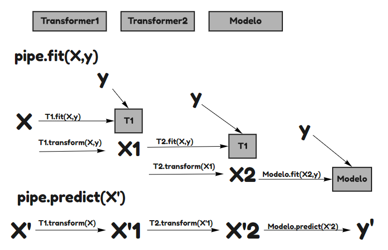
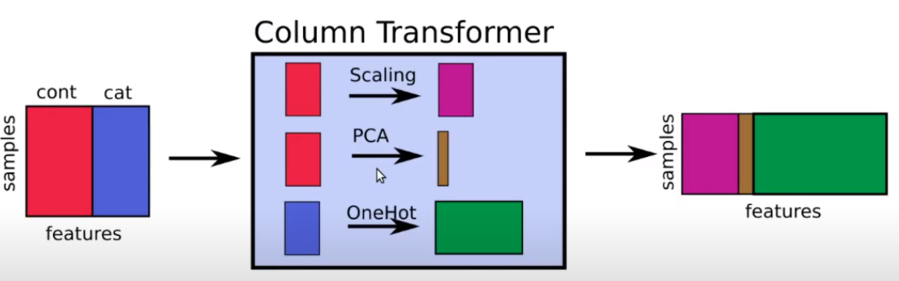

```{r setup, include=FALSE}
library(reticulate)
use_condaenv(condaenv = 'MLprojects')
options(htmltools.dir.version = FALSE)
knitr::opts_chunk$set(cache=TRUE)
```

```{r xaringan-themer, include=FALSE}
library(xaringanthemer)
solarized_light(
  code_font_family = "Fira Code",
  code_font_url    = "https://cdn.rawgit.com/tonsky/FiraCode/1.204/distr/fira_code.css"
)


```

# Pipelines

Trabajar con modelos de Machine Learning muchas veces requiere la combinación de muchos pasos que sean reproducibles tanto para el proceso de Entrenamiento como de Testeo/Validación. Es por eso que se necesita de una estructura robusta que soporte esto de manera estable.


.center[
```{r, echo = F, out.width='60%'}

```

]

---

# Pipelines

```{python, eval = FALSE}

from sklearn.pipeline import Pipeline
from category_encoders import OneHotEncoder
from sklearn.feature_selection import SelectPercentile, mutual_info_classif
from sklearn.model_selection import LogisticRegression


pipe = Pipeline(steps = [
  ('ohe', OneHotEncoder(use_cat_names = True))
  ('vs', SelectPercentile(mutual_info_clasif, percentile = 70)),
  ('lr', LogisticRegression(random_state = 123))
])

pipe.fit(X_train, y_train)

```

> NOTA: `pipe` ahora es un modelo, pero de muchas etapas. Esta es la manera correcta de trabajar en `scikit-learn` cuando se está en el proceso de entrenamiento/experimentación de un modelo.
Todos los pasos pueden ser `Transformers`, pero sólo el último paso puede ser un `Estimator`.

---

# Tratamiento de Nulos

Normalmente existen dos tipos de Nulos, los informativos y los MAR (missing at Random). Los informativos pueden ser útiles y quizás se pueden utilizar como una variable nueva. En cambio los valores MAR son por errores de proceso, no disponibilidad de información, etc.

Una estrategia simple en `scikit-learn` es utilizar `SimpleImputer()`:

```{python, eval = FALSE}
from sklearn.imputer import SimpleImputer
from sklearn.preprocessing import StandardScaler
from sklearn.model_selection import LinerRegression

num = Pipeline(steps = [
  ('imp_num', SimpleImputer(strategy = 'mean')),
  ('sc', StandardScaler()),
  ('lr', LinearRegression())
])

```

* strategy: Corresponde a la estrategia de imputación numérica disponible:
   * **'mean'**: Rellena con la media de cada columna.
   * **'median'**: Rellena con la mediana de cada columna.
   * **'most_frequent'**: Rellena con el valor más frecuenta. Normalmente utilizado con categorías.
   * **'constant'**: Reemplaza con un valor dado. Se debe agregar el parámetro adicional 'fill_value' con el valor a rellenar.
   
---

# Tratamiento de Nulos en Categorías

* La librería `category_encoders` es capaz de lidiar con variables nulos. Normalmente crear estrategias que le permitan manejar los valores nulos de manera autónoma.

* Además le permite lidiar con categorías no vistas durante el entrenamiento

* Puede crear categorías nuevas para los valores nulos.

* Podría no necesitar un proceso de Imputer ya que la librería se encarga.

```{python, eval = FALSE}

cat = Pipeline(steps = [
  ('ohe', OneHotEncoder(use_cat_names = True))
  ('lr', LinearRegression())
])
```

---

# Y qué pasa si quiero tratar categorías y números de manera distinta?

Existe el `ColumnTransformer()` que es un meta-estimator que ayuda a realizar procedimiento diferenciado a distintos sets de variables.

```{python, eval = FALSE}
from sklearn.compose import ColumnTransformer
prep = ColumnTransformer(trasformers = [
  ('cont', num_pipeline, var_num),
  ('cat', cat_pipeline, var_cat)
])
```

.center[

```{r, echo = F, out.width='60%'}

```

]


---

# Manipulando Pipelines

## Accediendo a valores Internos.

Cuando queremos recuperar atributos de etapas intermedias de un Pipeline necesitamos acceder a él utilizando `.named_steps.etapa_del_pipeline`. Donde `etapa_del_pipeline` es el nombre que nosotros asignamos a las distintas etapas de un Pipeline. Estas propiedades están disponibles sólo después de **fitear** el modelo.

```{python, eval = FALSE}
num = Pipeline(steps = [
  ('imp_num', SimpleImputer(strategy = 'mean')),
  ('sc', StandardScaler()),
  ('lr', LinearRegression())
])

# permite llamar los coeficientes que entrega
# una lr dentro de un pipeline.
num.named_steps.lr.coef_ 
```

> NOTA: Cuando queremos ingresar a una etapa de un ColumnTransformer se debe utilizar `.named_transformers_`.

---

# Manipulando Pipelines

## Qué pasa con el GridSearch?

La convención de `Scikit-Learn` para acceder hiperparámetros de un Pipeline es utilizando el nombre de la etapa y luego un doble underscore para el nombre del hipeparámetro.

Adicionalmente existe el comando `'passthrough'` que permite saltarse la etapa. 

> NOTA: Usar con cuidado ya que puede fallar si me salto una etapa que tiene hiperparámetros en búsqueda.

```{python, eval = FALSE}

num = Pipeline(steps = [
  ('imp_num', SimpleImputer(strategy = 'mean')),
  ('sc', StandardScaler()),
  ('lr', LinearRegression())
])

params = {'imp_num__strategy': ['mean', 'median'], # prueba dos estrategias de imputación
          'sc': ['passthrough', StandardScaler()]} # va a probar con y sin estandarización
          
GridSearchCV(num, params, cv = 5, scoring = 'accuracy', n_jobs = -1)

```

---


class: inverse, center, middle

<a rel="license" href="http://creativecommons.org/licenses/by-nc-sa/4.0/"></a><br /><span xmlns:dct="http://purl.org/dc/terms/" data-property="dct:title">Todas las clases del curso de Machine Learning Aplicado en Scikit-Learn</span> fueron creadas por
<span xmlns:cc="http://creativecommons.org/ns#" data-property="cc:attributionName">Alfonso
Tobar</span> y están licenciadas bajo <a rel="license" href="http://creativecommons.org/licenses/by-nc-sa/4.0/">Creative
Commons Attribution-NonCommercial-ShareAlike 4.0 International
License</a>.


