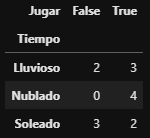

```{r setup, include=FALSE}
library(reticulate)
use_condaenv(condaenv = 'MLprojects')
options(htmltools.dir.version = FALSE)
knitr::opts_chunk$set(cache=TRUE)
```

```{r xaringan-themer, include=FALSE}
library(xaringanthemer)
solarized_light(
  code_font_family = "Fira Code",
  code_font_url    = "https://cdn.rawgit.com/tonsky/FiraCode/1.204/distr/fira_code.css"
)
```

# Teorema de Bayes

El modelo Naive Bayes es un módelo de **CLASIFICACIÓN** basado fuertemente en un contexto Probabilístico dado por el Teorema de Bayes:
    
$$P[B|A] = \frac{P[A | B] \cdot P[B]}{P[A]}$$

Existe una cierta nomenclatura para poder referirse a cada uno de los elementos conformantes del Modelo de Bayes:

* $P[A|B]$: Se le llama normalmente likelihood/verosimilitud el cual entrega la información que nosotros nos interesa y que sabemos de manera previa.
* $P[B]$: corresponde a la Probabilidad A priori del fenómeno estudiar. Se le llama a priori porque es la probabilidad del fenómeno sin estar definida por un condición.
* $P[A]$: Se le llama evidencia, y corresponde a la probabilidad de variables con las que queremos condicionar nuestro fenómeno.

* $P[B|A]$: Se le llama probabilidad a Posteriori y corresponde a la probabilidad luego de ser condicionada por mi Evidencia.   

---

# Ejemplo

Asumamos que sabemos que hay una probabilidad conjunta del 95% que cuando una persona le guste a alguien, sonría. Se sabe que existe un 10% de probabilidad que le sonría a un extraño y un 1% que le guste alguien al azar.  

* A posteriori: ¿Le gusto a alguien dado que me sonríe? 

* Incógnita  
  
--

* Verosimilitud: ¿Me sonríe porque le gusto?  

--

  * 0.95 
  
--

* A priori: ¿Cual es la probabilidad que le guste alguien al azar?  

--

  * 0.01 
  
--

* Evidencia: ¿Sonríe al azar?  

--

  * 0.1  
  

$$P[B|A] = \frac{P[A | B] \cdot P[B]}{P[A]} = 0.095$$

???

A: Será el evento Sonreir.
B: Evento Gustar a alguien.
---
## Cómo predice un Modelo Naive Bayes

.left-column[
.center[


```{r, echo = F, eval = TRUE, out.width='70%'}
knitr::include_graphics("img/nb_example.PNG")
```
]
]

.right-column[

```{python, eval = FALSE}
pd.crosstab(df.Tiempo, df.Jugar)

```


```{r, echo = F, eval = TRUE}

```

**X** : Será nuestra variable Tiempo

**y** : Jugar, Sí o No?

$$P[Jugar = True | Soleado] = \frac{P[Soleado | Jugar = True] * P[J=True]}{P[Soleado]}$$
]

???

P[Soleado | Jugar = True] = 2/9

P[Soleado | Jugar = True] = 0.64 = 9/14

P[Soleado] = 5/14


---

# Por qué *Naive* (Ingenuo)?

$$P[y| x_1,x_2,...,x_n] = \frac{P[y]\cdot \prod_{i=1}^n P(x_i|y)}{P[x_1,x_2,...,x_n]} \propto P[y]\cdot \prod_{i=1}^n P(x_i|y)$$

> NOTA: Existen muchos tipos de Modelos Naive Bayes en Scikit-Learn. La principal diferencia entre todos ellos es como calculan la Probabilidad Condicional. Para ello se hacen ciertos supuestos dependiendo de la distribución de los Datos.


---

# Implementación en Scikit - Learn

### Multinominal NB

.pull-left[

* **Pros**:
- Buen Modelo Baseline
- Rápido
- No muy complejo de trabajar ni procesar.
- Funciona bien con donde los predictores son conteos.

]

.pull-right[
* **Contras**
- Muy simplista
- Sus condiciones base no siempre son ciertas por lo que efectivamente es muy ingenuo.

]

```{python, eval = FALSE}
from sklearn.naive_bayes import MultinomialNB
MNB = MultinomialNB(alpha = 1) # no tiene random_state
MNB.fit(X, y)
y_pred = MNB.predict(X)
```

* $\alpha$: Corresponde a un parámetro de suavizamiento que toma en cuenta features no presentes en los datos de entrenamiento previniendo las probabilidades cero. $\alpha = 1$ es llamado suavizamiento de Laplace mientras que $\alpha < 0$ es llamado Suavizamiento de Lidstone.

---

# Implementación en Scikit - Learn

### Gaussian NB

```{python, eval = FALSE}
from sklearn.naive_bayes import MultinomialNB
GNB = GaussianNB(var_smoothing = 1e-09) # no tiene random_state
GNB.fit(X, y)
y_pred = GNB.predict(X)
```

> NOTA: Este modelo permite utilizar variables continuas como predictoras. En este caso asume una que los predictores asumen una distribución normal.


$$P[x_i| y] = \frac{1}{\sqrt{2\pi\sigma_y^2}}exp\left(-\frac{(x_i-\mu_y)^2}{2\sigma_y^2}\right)$$

donde $\mu_y$ y $\sigma_y$ se calculan por máxima verosimilitud.

* **var_smoothing**: Corresponde a un parámetro de estabilidad de cálculo.

---
class: inverse, center, middle

<a rel="license" href="http://creativecommons.org/licenses/by-nc-sa/4.0/"></a><br /><span xmlns:dct="http://purl.org/dc/terms/" data-property="dct:title">Todas las clases del curso de Machine Learning Aplicado en Scikit-Learn</span> fueron creadas por
<span xmlns:cc="http://creativecommons.org/ns#" data-property="cc:attributionName">Alfonso
Tobar</span> y están licenciadas bajo <a rel="license" href="http://creativecommons.org/licenses/by-nc-sa/4.0/">Creative
Commons Attribution-NonCommercial-ShareAlike 4.0 International
License</a>.


