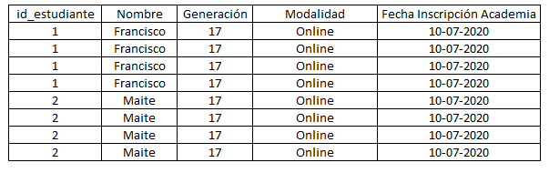
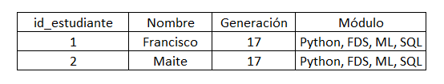
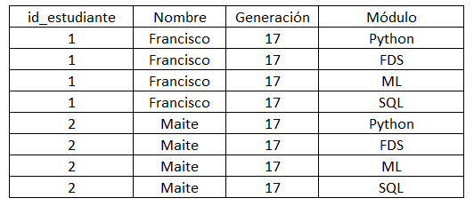
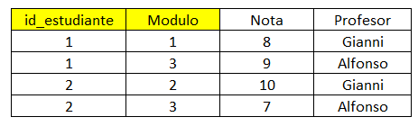
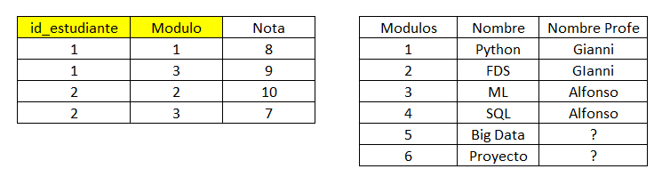
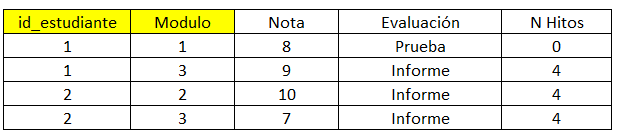
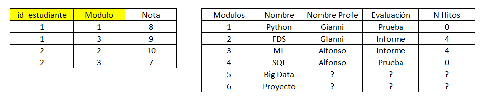
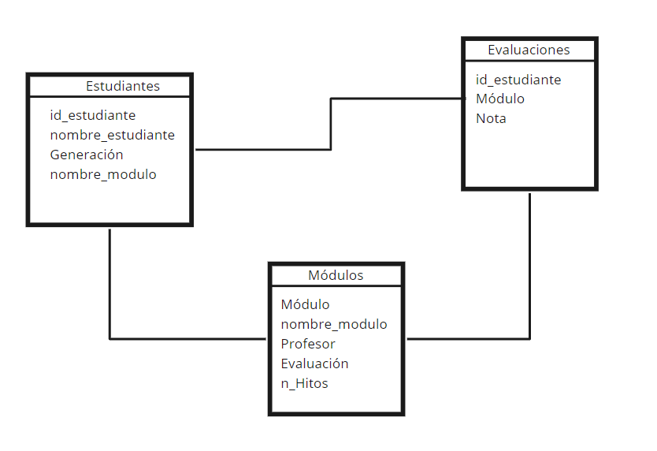

```{r setup, include=FALSE}
library(reticulate)
use_condaenv(condaenv = 'MLprojects')
options(htmltools.dir.version = FALSE)
knitr::opts_chunk$set(cache=TRUE)
```

```{r xaringan-themer, include=FALSE}
library(xaringanthemer)
solarized_light(
  code_font_family = "Fira Code",
  code_font_url    = "https://cdn.rawgit.com/tonsky/FiraCode/1.204/distr/fira_code.css"
)
```

# Normalización

El objetivo principal de la Normalización de la Base de Datos es disminuir la Redundancia de manera de ahorrar espacio de almacenamiento como de evitar problemas en el mantenimiento de la base de datos.

```{r, echo = F, eval = TRUE, out.width='70%'}

```
---

# Ejemplo

```{r, echo = F, eval = TRUE, out.width='70%'}

```

El primer problema que se puede ver a partir de eso es que tenemos varios campos ingresados en una sola columna, lo cual es óptimo.

#### ¿Cómo determino qué Alumno han tomado el módulo de ML?

```{python, eval = FALSE}
SELECT NOMBRE
FROM ESTUDIANTES
WHERE MODULO = 'ML'

```
---

# Solución 
## Primera forma Normalizada

.center[

```{r, echo = F, eval = TRUE, out.width='60%'}

```
]

**Requisitos**:

* Cada elemento debe tener valores atómicos (indivisibles).
* Cada columna debe tener elementos del mismo tipo de dato.
* Cada columna debe tener nombres únicos.
* El orden que se ingresen los datos no importa.


---

## Otro problema...

.center[

```{r, echo = F, eval = TRUE, out.width='70%'}

```
]

--

* Se tiene un caso de Clave Primaria compuesta.

* Se tiene redundancia de datos en la Columna Profesor, ya que la columna Profesor tiene una dependencia parcial.

---

# Solución 
## Segunda forma Normalizada

.center[
```{r, echo = F, eval = TRUE, out.width='70%'}

```
]

**Requisitos**:
* Todos los Requisitos de la Primera forma Normalizada.
* Que no haya dependencia parcial.

---
## Último problema...


.center[
```{r, echo = F, eval = TRUE, out.width='70%'}

```
]

--

* También existe un tipo de redundancia que en este caso se manifiesta en el Número de Hitos.

* También hay dependencia transitiva.
---

# Solución 
## Tercera forma Normalizada

.center[
```{r, echo = F, eval = TRUE, out.width='90%'}

```
]

**Requisitos**:
* Todos los Requisitos de la Primera y Segunda forma Normalizada.
* Que no haya dependencia Transitiva.

---

# Esquema Final

.center[
```{r, echo = F, eval = TRUE, out.width='60%'}

```
]


