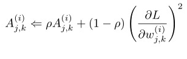
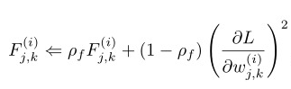
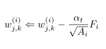
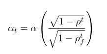
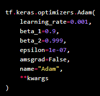
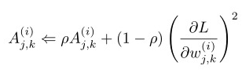
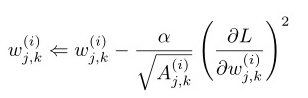
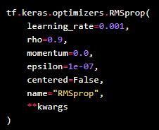

```{r setup, include=FALSE}
library(reticulate)
use_condaenv(condaenv = 'MLprojects')
options(htmltools.dir.version = FALSE)
knitr::opts_chunk$set(cache=TRUE)
```

```{r xaringan-themer, include=FALSE}
library(xaringanthemer)
solarized_light(
  code_font_family = "Fira Code",
  code_font_url    = "https://cdn.rawgit.com/tonsky/FiraCode/1.204/distr/fira_code.css"
)

```

# Redes Neuronales Densas

Una red neuronal tiene muchos hiperparametros y el correcto uso de ellos dependerá exclusivamente del entendimiento que se tenga de los procesos de optimización y el tipo de problema a resolver.

Durante esta clase se revisará algunos de los parámetros más simples que se pueden variar de modo de mejorar la performance de la red Neuronal:

## Parámetros de Neurona

* **units**: Número de Neuronas
* **activation**: La función de activación a utilizar
* **Número de Capas**: Cuantas capas ocultas utilizar.

> NOTA:
Estos hiperaparámetros se cambiarán directamente en la capa densa y en la estructura de la red.

---

## Regularización:

* **Agregar capa Dropout**: Esta corresponde a una capa adicional que se agrega después de una capa oculta. Esta capa adicional genera una desconexión aleatoria de una proporción de las conexiones. Tiene como único hiperparámetro **rate** que indica la proporción de neuronas a desconectar.

* **Utilizar proceso de mini-batch**: Este proceso evita que toda la data viaje en Forward y en Backward. SU pro es que evita que la Red se ajuste a toda la data a la vez, el contra es que el proceso de entrenamiento se vuelve más largo.

.center[
```{r, echo = FALSE, out.width='50%'}
knitr::include_graphics("img/DNN.png")
```
]

---

## Optimizer

Keras tiene 8 tipos de Optimizers distintos:
Normalmente los valores por defecto funcionan bastante bien, y determinar valores distintos a ello implica un estudio más profundo del optimizer en cuestión.

* **Adam**: 

.pull-left[
.center[
```{r, echo = FALSE, out.width='60%'}

```
```{r, echo = FALSE, out.width='60%'}

```

```{r, echo = FALSE, out.width='40%'}

```

]
]

.pull-right[
```{r, echo = FALSE, out.width='50%'}

```

```{r, echo = FALSE, out.width='50%'}

```
]


---

# Optimizer
  
* **Rmsprop**:

.pull-left[
```{r, echo = FALSE, out.width='50%'}

```

```{r, echo = FALSE, out.width='50%'}

```


]

.pull-right[
```{r, echo = FALSE, out.width='50%'}

```

]


---

class: inverse, center, middle

<a rel="license" href="http://creativecommons.org/licenses/by-nc-sa/4.0/"></a><br /><span xmlns:dct="http://purl.org/dc/terms/" data-property="dct:title">Estas clases</span> fueron creadas por
<span xmlns:cc="http://creativecommons.org/ns#" data-property="cc:attributionName">Alfonso
Tobar</span> y están licenciadas bajo <a rel="license" href="http://creativecommons.org/licenses/by-nc-sa/4.0/">Creative
Commons Attribution-NonCommercial-ShareAlike 4.0 International
License</a>.


