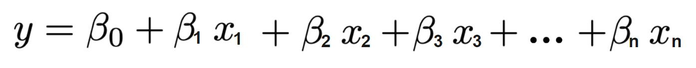
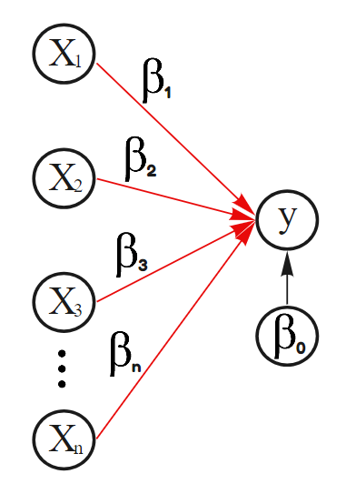
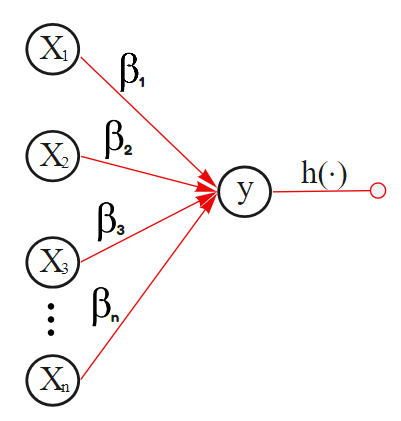
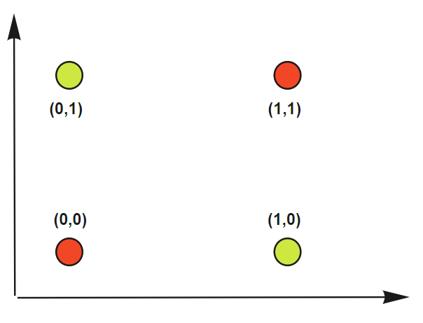
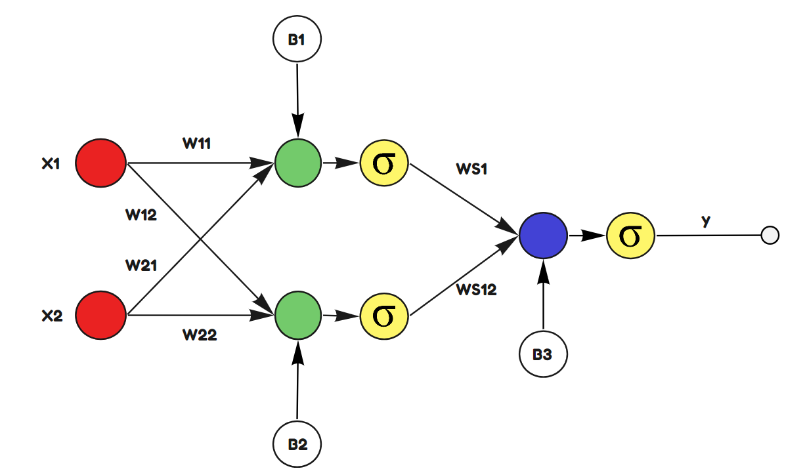

```{r setup, include=FALSE}
library(reticulate)
use_condaenv(condaenv = 'MLprojects')
options(htmltools.dir.version = FALSE)
knitr::opts_chunk$set(cache=TRUE)
```

```{r xaringan-themer, include=FALSE}
library(xaringanthemer)
solarized_light(
  code_font_family = "Fira Code",
  code_font_url    = "https://cdn.rawgit.com/tonsky/FiraCode/1.204/distr/fira_code.css"
)

```
# Qué son las Redes Neuronales?

Las redes neuronales son una manera gráfica de mostrar un proceso de modelamiento iterativo.


.left-column[

## Regresión Lineal

```{r, echo = FALSE, out.width = 600}

```

Cuando se trata de Redes Neuronales hay algunos terminos que van a cambiar. 

* Cada de los Circulos será una Neurona y albelgarán un número en su interior. 
* Cada una de las uniones (Edges) contenerán entonces los valores de $\beta$ que de ahora en adelante se llamarán pesos. 

NOTA: Esta configuración es lo que se le denomina un **Perceptrón**.

]

.right-column[

```{r, echo = FALSE}

```

]


---

# Qué son las Redes Neuronales?

### Regresión Logística

.pull-left[

```{r, echo = FALSE, out.width= 370}

```

]

.pull-right[
 
En el caso de la Regresión Logística la idea es la misma. Con la sutil diferncia que se aplica una función $h(x)$ la cual es la Función Logística (Sigmoide, Logit).

$$h(z) = \frac{1}{1 + e^{-z}}$$

Esta función le da a la regresión Lineal la versatilidad de ahora poder lidiar con problemas de clasificación. En redes neuronales, una función que permita dar versatilidad, en especial de entregar la capacidad de encontrar valores no lineales se le llama función de activación.


]

---

# Problema XOR

.center[

```{r, echo = FALSE, out.width='60%'}

```


]

---

# Utilizando una Red Neuronal para resolver XOR

.center[

```{r, echo = FALSE, out.width='70%'}

```


]


---

# Implementando la solución en Numpy

.pull-left[

### Función de Activación

$$\sigma(x) = \frac{1}{1 + e^{-x}}$$
.pull-left[

* **W11:** 20

* **W12:** -20

* **W21:** 20

* **W22:** -20

]

.pull-right[

* **Ws1:** 20

* **Ws2:** 20

* **B1:** -10

* **B2:** 30

* **B3:** 30

]

]

--

.pull-right[


> **NOTA**: Notar que estamos resolviendo un problema no-lineal, utiizando 3 modelos lineales. 

.pull-left[

```{r, echo = FALSE, out.width='80%'}
knitr::include_graphics("https://media.giphy.com/media/l3q2K5jinAlChoCLS/giphy.gif")
```
]

.pull.right[
```{r, echo = FALSE, out.width='50%'}
knitr::include_graphics("https://media.giphy.com/media/doJrCO8kCAgNy/giphy.gif")
```


]

]

---

class: inverse, center, middle

<a rel="license" href="http://creativecommons.org/licenses/by-nc-sa/4.0/"></a><br /><span xmlns:dct="http://purl.org/dc/terms/" data-property="dct:title">Estas clases</span> fueron creadas por
<span xmlns:cc="http://creativecommons.org/ns#" data-property="cc:attributionName">Alfonso
Tobar</span> y están licenciadas bajo <a rel="license" href="http://creativecommons.org/licenses/by-nc-sa/4.0/">Creative
Commons Attribution-NonCommercial-ShareAlike 4.0 International
License</a>.


