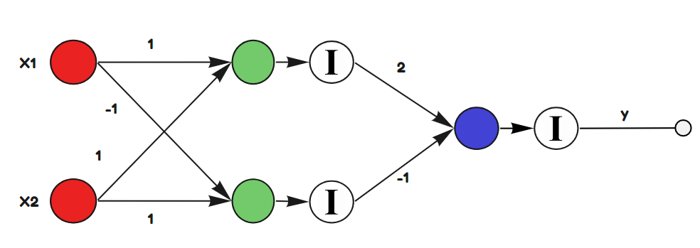
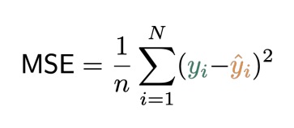

```{r setup, include=FALSE}
library(reticulate)
use_condaenv(condaenv = 'MLprojects')
options(htmltools.dir.version = FALSE)
knitr::opts_chunk$set(cache=TRUE)
```

```{r xaringan-themer, include=FALSE}
library(xaringanthemer)
solarized_light(
  code_font_family = "Fira Code",
  code_font_url    = "https://cdn.rawgit.com/tonsky/FiraCode/1.204/distr/fira_code.css"
)

```


# Utilizando una Red Neuronal para Regresión

.center[

```{r, echo = FALSE, out.width='90%'}

```


]

**Valor Real**: 13 para X1 = 2 y X3 = 3

---

# Función de Costo (Loss Function)

```{r, echo = FALSE, out.width='30%'}

```

Corresponde a la cuantificación del error. Este error es el encargado decirle a la red si debe seguir aprendiendo o ya ha sido entrenada. Si esta función de Costo es 0, entonces el modelo es perfecto. En cualquier otro caso, debe seguir aprendiendo.

Si es que el proceso de entrenamiento no termina (no se ha alcanzado el modelo óptimo), entonces el modelo debe comenzar el proceso de backpropagation.

$$W_{j} = W_j - \alpha \cdot \frac{\partial}{\partial W_j}J(W_j)$$

---

# Backpropagation

```{r, echo = FALSE, out.width='90%'}

```

---

# Funciones de Activación

.pull-left[

.center[
```{r, echo = FALSE, out.width='60%'}
knitr::include_graphics("img/identity.png")
```

```{r, echo = FALSE, out.width='60%'}
knitr::include_graphics("img/sigmoide.png")
```


]

]

.pull-right[

.center[
```{r, echo = FALSE, out.width='60%'}
knitr::include_graphics("img/tanh.png")
```


```{r, echo = FALSE, out.width='60%'}
knitr::include_graphics("img/relu.png")
```
]

]


---

class: inverse, center, middle

<a rel="license" href="http://creativecommons.org/licenses/by-nc-sa/4.0/"></a><br /><span xmlns:dct="http://purl.org/dc/terms/" data-property="dct:title">Estas clases</span> fueron creadas por
<span xmlns:cc="http://creativecommons.org/ns#" data-property="cc:attributionName">Alfonso
Tobar</span> y están licenciadas bajo <a rel="license" href="http://creativecommons.org/licenses/by-nc-sa/4.0/">Creative
Commons Attribution-NonCommercial-ShareAlike 4.0 International
License</a>.


